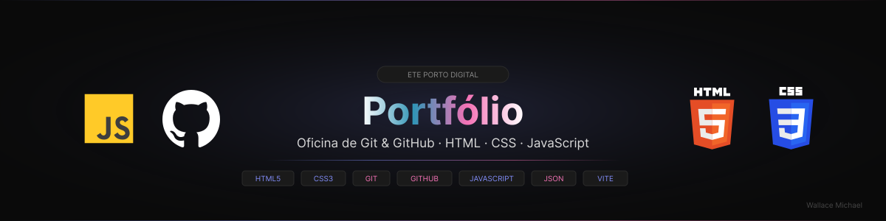

<p align="center">
  
</p>

<p align="center">
  <a href="https://github.com/WallaceMichael/portfolio-dev-etepd/stargazers">
    
  </a>
  <a href="https://github.com/WallaceMichael/portfolio-dev-etepd/commits/main">
    
  </a>
  
  
</p>

---

## 💡 Sobre o projeto

Projeto desenvolvido durante a oficina prática de **Git e GitHub** na [ETE Porto Digital](https://www.instagram.com/eteportodigital/), com foco na criação e publicação de um portfólio simples para desenvolvedores em formação.

Durante a oficina, os participantes aprendem na prática como criar um repositório, versionar arquivos, trabalhar com branches e disponibilizar seus projetos na internet, tudo com ferramentas reais do mercado.

---

## 🎯 Objetivos da oficina

- [x] Apresentar o Git e GitHub de forma prática
- [x] Ensinar comandos essenciais de versionamento
- [x] Desenvolver um portfólio em HTML, CSS e JavaScript
- [x] Publicar o projeto online via GitHub Pages
- [x] Incentivar a criação de projetos autorais

---

## 🛠️ Tecnologias utilizadas

| Tecnologia | Versão | Uso |
|------------|--------|-----|
|  | 5 | Estrutura das páginas |
|  | 3 | Estilização e responsividade |
|  | ES6+ | Interatividade e filtros |
|  | — | Versionamento |
|  | — | Hospedagem e deploy |

---

## 📂 Estrutura do projeto

```
portfolio-dev-etepd/
│
├── assets/
│   ├── css/
│   ├── docs/
│   │   └── banner-dev.svg        ← banner do README
│   ├── images/
│   │   └── foto.jpg/
│   └── js/
│
├── data/
│   └── projects.json
│
├── index.html
├── about.html
├── projects.html
├── skills.html
├── contact.html
├── favicon.ico
└── README.md
```

---

## ⚙️ Funcionalidades

- **Hero Section** — apresentação com status de disponibilidade
- **Projetos dinâmicos** — listagem carregada via `projects.json`
- **Filtro e busca** — filtra projetos por tecnologia em tempo real
- **Skills** — barras de progresso animadas e certificações
- **Contato** — formulário com validação e links sociais
- **Download de currículo** — disponível direto na página
- **Toggle dark/light** — troca de tema com preferência salva

---

## 🚀 Como usar

### 1. Clone o repositório

```bash
git clone https://github.com/WallaceMichael/portfolio-dev-etepd.git
cd portfolio-dev-etepd
```

### 2. Abra no VS Code

```bash
code .
```

### 3. Rode com Live Server

Clique em **Go Live** na barra inferior do VS Code e acesse `http://127.0.0.1:5500`.

> Não tem o Live Server? Instale pela aba de **Extensões** (`Ctrl+Shift+X`).

---

## 📧 Configuração do formulário com EmailJS

Para que o formulário de contato funcione corretamente, é necessário configurar o EmailJS.

---

### 1. Criar conta no EmailJS

- Acesse: https://www.emailjs.com  
- Clique em **Sign Up** e crie sua conta  

---

### 2. Criar um serviço de email

- Vá em **Email Services**  
- Clique em **Add New Service**  
- Escolha (ex: Gmail)  
- Conecte sua conta  

👉 Após isso, copie o **Service ID**

---

### 3. Criar um template de email

- Vá em **Email Templates**  
- Clique em **Create New Template**  

Exemplo de template:

<div style="background:#f9f9f9;padding:24px;font-family:system-ui,Arial,sans-serif;">
<table role="presentation" width="100%" cellpadding="0" cellspacing="0"
  style="max-width:580px;margin:0 auto;background:#ffffff;border:1px solid #e0e0e0;border-radius:12px;overflow:hidden;">

  <!-- HEADER -->
  <tr>
    <td style="background:#0f0f0f;padding:18px 24px;">
      <table role="presentation" width="100%" cellpadding="0" cellspacing="0"><tr>
        <td><table role="presentation" cellpadding="0" cellspacing="0"><tr>
          <td style="vertical-align:middle;padding-right:8px;">
            <div style="width:8px;height:8px;border-radius:50%;background:#818CF8;"></div>
          </td>
          <td style="vertical-align:middle;">
            <span style="font-size:11px;font-family:'Courier New',monospace;letter-spacing:2px;text-transform:uppercase;color:#888;">Portfólio · Contato</span>
          </td>
        </tr></table></td>
        <td style="text-align:right;">
          <span style="font-size:11px;font-family:'Courier New',monospace;color:#555;">{{time}}</span>
        </td>
      </tr></table>
    </td>
  </tr>

  <!-- REMETENTE -->
  <tr>
    <td style="padding:20px 24px;border-bottom:1px solid #e8e8e8;">
      <table role="presentation" width="100%" cellpadding="0" cellspacing="0"><tr>
        <td style="vertical-align:middle;width:52px;">
          <div style="width:48px;height:48px;border-radius:50%;background:#818CF8;text-align:center;line-height:48px;font-size:20px;color:#fff;">👤</div>
        </td>
        <td style="vertical-align:middle;padding-left:14px;">
          <div style="font-size:15px;font-weight:700;color:#111;margin-bottom:3px;">{{nome}}</div>
          <div style="font-size:12px;font-family:'Courier New',monospace;color:#818CF8;">{{email}}</div>
        </td>
        <td style="vertical-align:middle;text-align:right;white-space:nowrap;">
          <span style="display:inline-block;padding:4px 12px;background:#f5f5f5;border:1px solid #e0e0e0;border-radius:6px;font-size:11px;font-family:'Courier New',monospace;color:#888;letter-spacing:1px;text-transform:uppercase;">NOVO</span>
        </td>
      </tr></table>
    </td>
  </tr>

  <!-- ASSUNTO + MENSAGEM -->
  <tr>
    <td style="padding:20px 24px;border-bottom:1px solid #e8e8e8;">
      <div style="font-size:10px;font-family:'Courier New',monospace;letter-spacing:2px;text-transform:uppercase;color:#aaa;margin-bottom:5px;">Assunto</div>
      <div style="font-size:15px;font-weight:700;color:#111;margin-bottom:18px;">{{assunto}}</div>
      <div style="font-size:10px;font-family:'Courier New',monospace;letter-spacing:2px;text-transform:uppercase;color:#aaa;margin-bottom:8px;">Mensagem</div>
      <table role="presentation" width="100%" cellpadding="0" cellspacing="0"><tr>
        <td style="width:3px;background:#818CF8;">&nbsp;</td>
        <td style="background:#f8f8f8;padding:14px 16px;border-radius:0 8px 8px 0;">
          <p style="font-size:14px;line-height:1.75;color:#333;margin:0;">{{mensagem}}</p>
        </td>
      </tr></table>
    </td>
  </tr>

  <!-- CTA -->
  <tr>
    <td style="padding:16px 24px;">
      <table role="presentation" width="100%" cellpadding="0" cellspacing="0"><tr>
        <td style="vertical-align:middle;">
          <table role="presentation" cellpadding="0" cellspacing="0"><tr>
            <td style="vertical-align:middle;padding-right:6px;">
              <div style="width:7px;height:7px;border-radius:50%;background:#4ade80;"></div>
            </td>
            <td style="vertical-align:middle;">
              <span style="font-size:11px;font-family:'Courier New',monospace;color:#aaa;letter-spacing:1px;">Disponível para responder</span>
            </td>
          </tr></table>
        </td>
        <td style="text-align:right;vertical-align:middle;">
          <a href="mailto:{{email}}"
             style="display:inline-block;padding:10px 22px;background:#818CF8;color:#ffffff;text-decoration:none;border-radius:8px;font-size:12px;font-family:'Courier New',monospace;letter-spacing:1px;text-transform:uppercase;font-weight:600;">
            Responder ↗
          </a>
        </td>
      </tr></table>
    </td>
  </tr>

</table>
<p style="text-align:center;font-size:11px;font-family:'Courier New',monospace;color:#aaa;margin-top:16px;letter-spacing:1px;">
  Enviado automaticamente pelo seu portfólio
</p>
</div>

```
👉 Salve e copie o Template ID

### 4. Pegar sua Public Key

- Vá em **Account > API Keys**  
- Copie sua **Public Key**  

e substitua no arquivo script.js no onde esta comentado na sessão de formulario procure por service ID e template ID e PUBLIC KEY
## 🔗 Acesse o projeto

<p>
  <a href="https://github.com/WallaceMichael/portfolio-dev-etepd">
    
  </a>
  &nbsp;
  
</p>

---

## 👨‍💻 Autor

<table>
  <tr>
    <td align="center">
      <br/>
      <strong>Wallace Michael</strong><br/>
      <sub>Desenvolvedor em formação 🚀</sub><br/><br/>
      <a href="https://github.com/WallaceMichael">
        
      </a>
      &nbsp;
      <a href="https://linkedin.com/in/wallacemichael">
        
      </a>
    </td>
  </tr>
</table>

---

<p align="center">
  Feito com ❤️ durante a oficina de <strong>Git &amp; GitHub</strong> · ETE Porto Digital
</p>